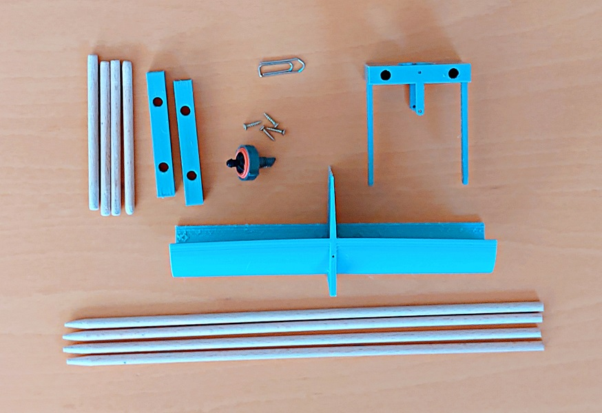

# Drops Splitter, Drops Divider 

https://youtu.be/7W9dnTsFphQ

The Drops Divider is an addition to the Gardena Micro-Drip irrigation system. It ?distributes? the drops of a [end dripper](https://www.gardena.com/ch-de/produkte/bewasserung/micro-drip-system/endtropfer-druckausgleichend/901161101/) into two pots.

An alternative solution to the Drops Divider are [Gardena's adjustable drippers](https://www.gardena.com/ch-de/produkte/bewasserung/micro-drip-system/regulierbarer-endtropfer/900914901/).

I like plants. But I don't like watering the plants so I bought an irrigation system. With one little problem: The small pots get too much water.

The Drops Splitter equally distributes the water into two small pots; they now get half the water the medium sized pots get.

Besides the fact that it works, it has a meditative character watching the swing rock from side to side.

Endtropfer (regulierbarer endtropfer) adjustable dripper, adjustable end dripper

https://www.galaxus.ch/en/s4/product/gardena-end-dropper-final-dripper-drip-irrigation-256992

Düse nozzle, spray valve

Tropfer: dripper (agr)

flow divider   Dampfstrom Strömungsteiler

Schaukel : seesaw, rocker

https://de.hinative.com/questions/688524

A drip is a small amount of liquid forming on lower side of something. A drop is a drip that has now fallen and hit something.

## Supplies

Gardena end dropper, final dripper

https://www.galaxus.ch/en/s4/product/gardena-end-dropper-final-dripper-drip-irrigation-256993

4 M2 x l10 mm flat headed screw

4 Wooden rod 4 x l120

4 Wooden rod 4 x l120

1 Paperclip d1

1 3D Printer

60 g PLA filament

Legend: l:length in millimeters, d:diameter in millimeters

## 3D Printed Parts

You can use PLA with 20% filling. If you don't have a 3D printer, I recommend looking for a 3D printing service nearby.

## Assembly of the dripper

Insert the dripper into the opening provided and fix it with two M2 screws. Screw the other two screws into the holes in the two short legs. These two screws are used as fine adjustment screws.

## Seesaw Suspension

Use the four short wooden rods as spacers and the four long wooden rods as pillars to be stuck into the ground

## Seesaw Assembly

Use a paperclip side piece on each side to secure the seesaw to the the suspension.

That is the Drops Divider!

